## Part 1. Готовый манифест

- запустил окружение Kubernetes: `minikube start --driver=docker --memory=4096`

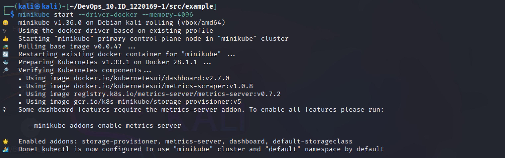
- применил манифест:`kubectl apply -f src/example/`

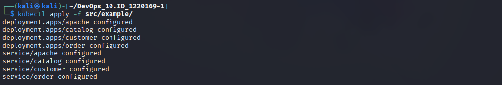
- запустил панель управления:`minikube dashboard`

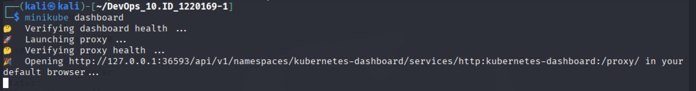
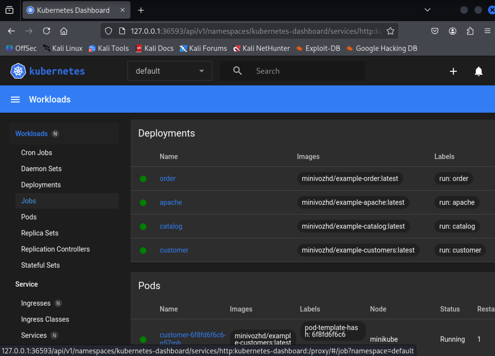
- Проброс туннелей к сервисам
  - определил имя сервиса apache:`minikube service list`

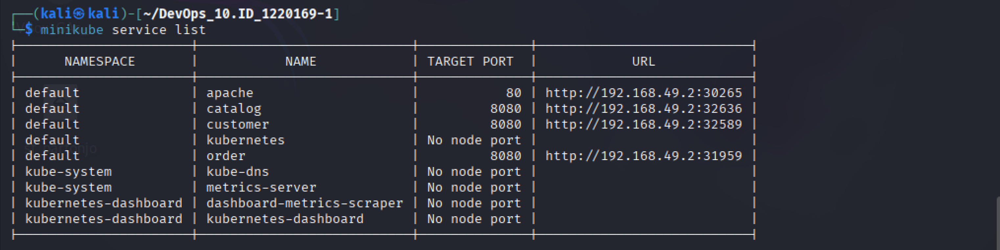
- Проверка работоспособности
  - Открыл в браузере URL: http://192.168.49.2:30265
  - Убедился, что страница Apache загружается

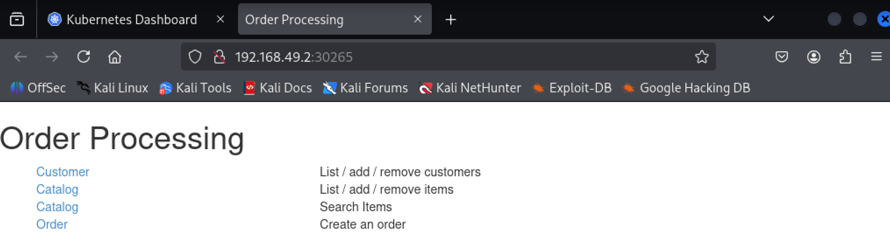

 ## Part 2. Собственный манифест

- Порядок действий для запуска:
  - Собрать Docker-образы для всех сервисов
  - Применить манифесты: `kubectl apply -f src/k8s/`
  - Проверить состояние:`kubectl get all`,`kubectl get secrets`,`kubectl get configmap`

- Сборка образов:
  - Для каждого сервиса выполнил в его директории:
```bash
# Переключить docker на minikube
eval $(minikube docker-env)

# Собрать образ
docker build -t [service-name]-service:latest .
```

```bash
cd src/services
# Сборка booking-service
cd booking-service
docker build -t booking-service:latest .
# Сборка hotel-service
cd ../hotel-service
docker build -t hotel-service:latest .
# Сборка loyalty-service
cd ../loyalty-service
docker build -t loyalty-service:latest .
# Сборка payment-service
cd ../payment-service
docker build -t payment-service:latest .
# Сборка gateway-service
cd ../gateway-service
docker build -t gateway-service:latest .
# Сборка report-service
cd ../report-service
docker build -t report-service:latest .
# Сборка session-service
cd ../session-service
docker build -t session-service:latest .
```

- Или можно собрать сразу все образы внутри Minikube:
```bash
# Переключиться на Docker Minikube
eval $(minikube docker-env)

# Собрать образы для всех сервисов
cd src/services
for service in *; do
  cd $service
  docker build -t ${service}:latest .
  cd ..
done
```

- Создал файлы манифестов для всех 7 сервисов.
- Все манифесты включают:
  - ConfigMap со всеми необходимыми переменными окружения
  - Secrets для хранения чувствительных данных
  - Deployments и Services для всех компонентов системы
  - Persistence Volume для PostgreSQL
  - Настройки для RabbitMQ
  - Проксирование доступа к gateway и session сервисам


- Применил манифесты по одному командой: `kubectl apply -f <manifest>.yaml`

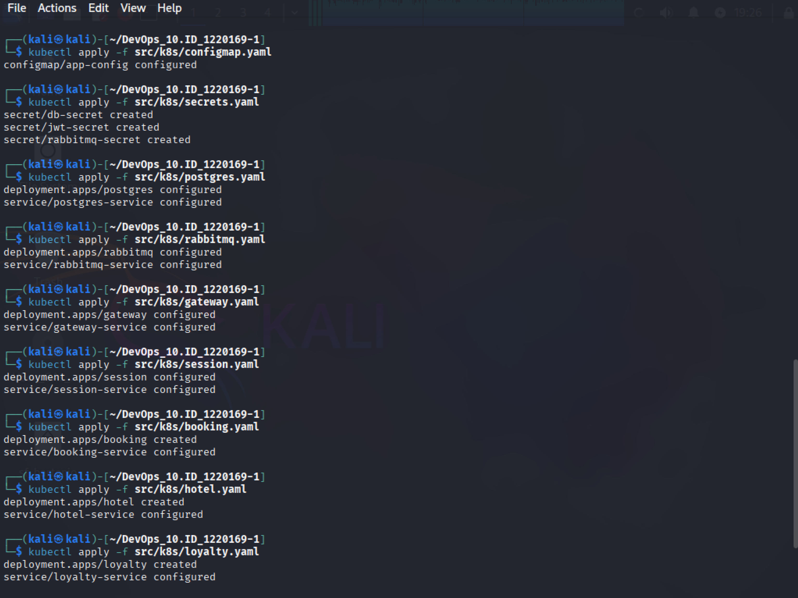

- Порядок применения манифестов:
```bash
# Сначала надо применить базовые конфигурации
kubectl apply -f src/k8s/configmap.yaml
kubectl apply -f src/k8s/secrets.yaml

# Затем инфраструктурные сервисы
kubectl apply -f src/k8s/postgres.yaml
kubectl apply -f src/k8s/rabbitmq.yaml
   
# Потом все микросервисы
kubectl apply -f src/k8s/gateway.yaml
kubectl apply -f src/k8s/session.yaml
kubectl apply -f src/k8s/booking.yaml
kubectl apply -f src/k8s/hotel.yaml
kubectl apply -f src/k8s/loyalty.yaml
kubectl apply -f src/k8s/payment.yaml
kubectl apply -f src/k8s/report.yaml
```
```bash
# или можно применить все сразу
kubectl apply -f src/k8s/
```
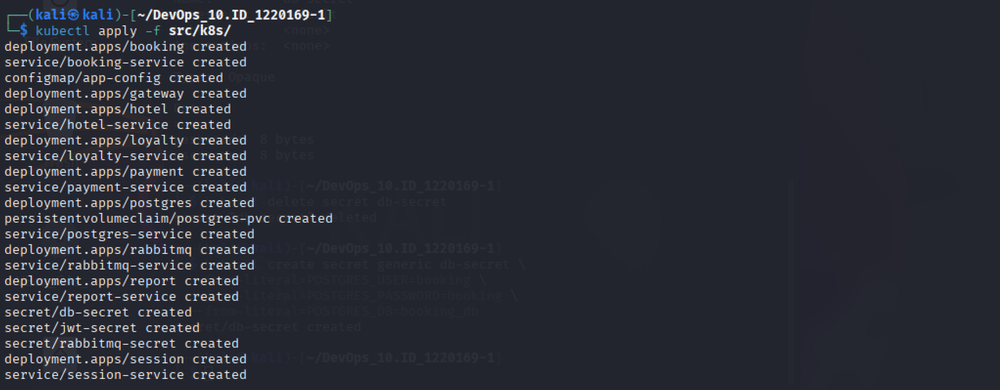


- Проверил статус созданных объектов командой: `kubectl get all` и `kubectl describe <object_type> <object_name>`

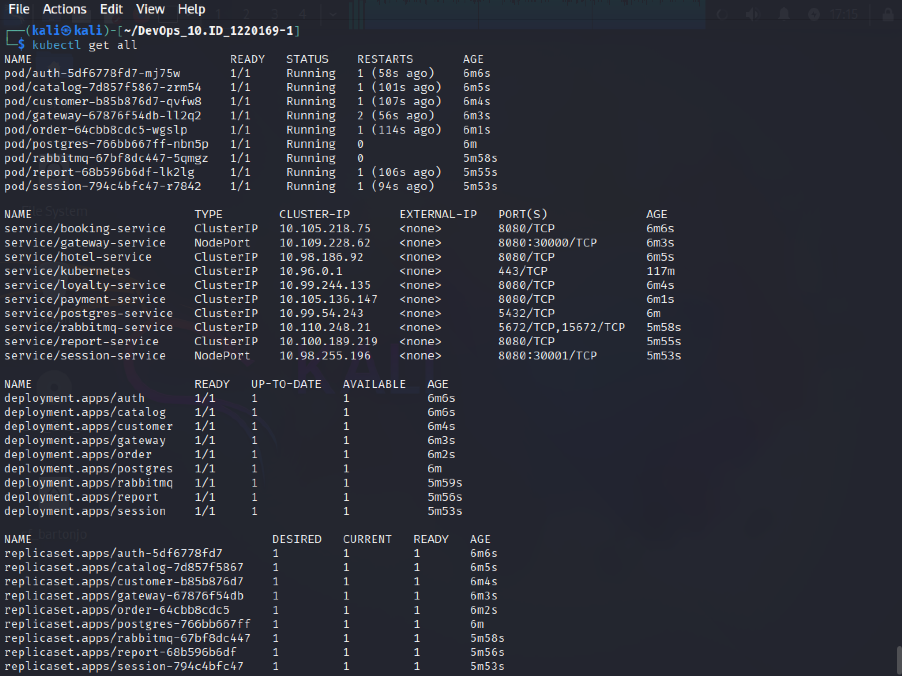
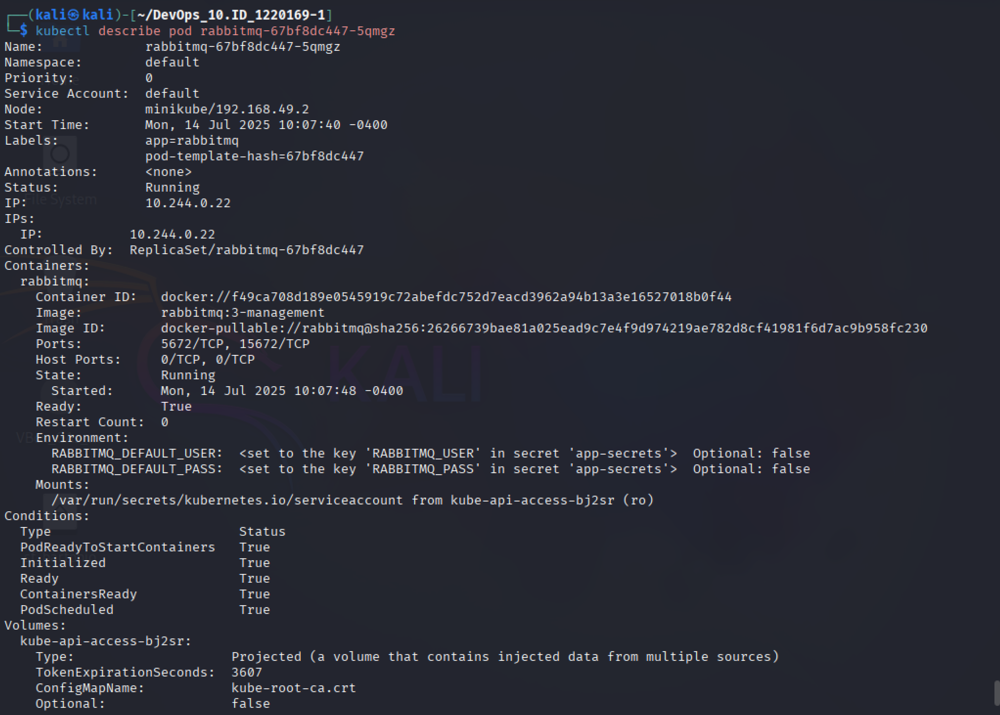

- Все pods в состоянии running: `kubectl get pods -w`

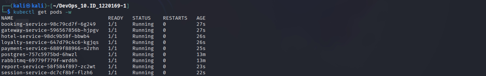

- Проверил описание секретов командой: `kubectl describe secret app-secrets`

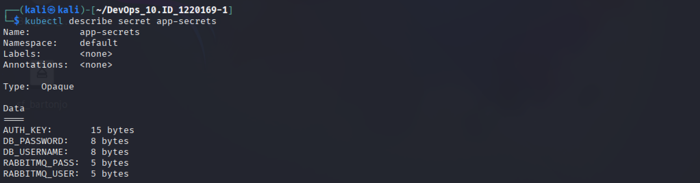

- Потом декодировал секреты:

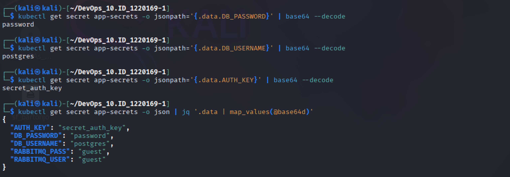

- Проверил логи приложения, запущенного в кластере: `kubectl logs <container_name>`

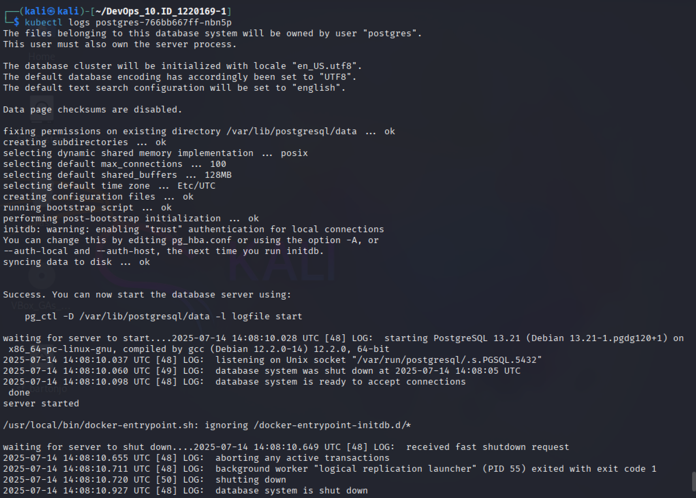

- Создал туннели к сервисам: `minikube service gateway-service --url` и `minikube service session-service --url`


- Особенности сервисов:
  - Все сервисы используют порт 8080, кроме специально указанных (session-service и gateway-service используют NodePort 30001 и 30000 соответственно)
  - `gateway-service` и `session-service` имеют тип NodePort для внешнего доступа
  - Остальные сервисы используют ClusterIP (доступны только внутри кластера)
- Все сервисы будут использовать единую конфигурацию (ConfigMap) и секреты, развернуты в одном экземпляре (replicas: 1) и доступны внутри кластера через свои DNS-имена.

- Запустил тесты Postman (Newman CLI):
```bash
newman run src/application_tests.postman_collection.json \
  --env-var "GATEWAY_URL=http://$(minikube ip):30000" \
  --env-var "SESSION_URL=http://$(minikube ip):30001"
```
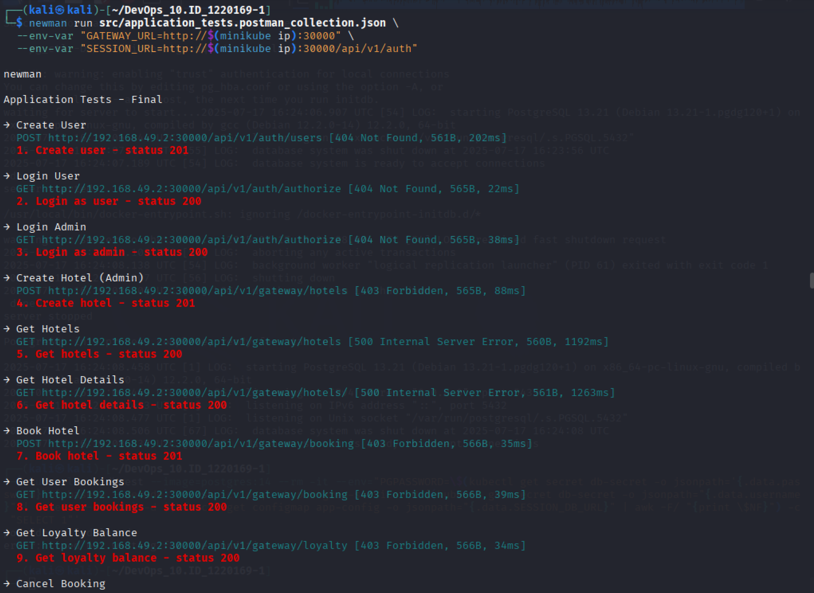

- Запустил стандартную панель управления Kubernetes: `minikube dashboard`
- Dashboard с метриками ресурсов: Nodes, Deployments, Pods, Secrets, Config-maps, Services, Logs, CPU/Memory usage

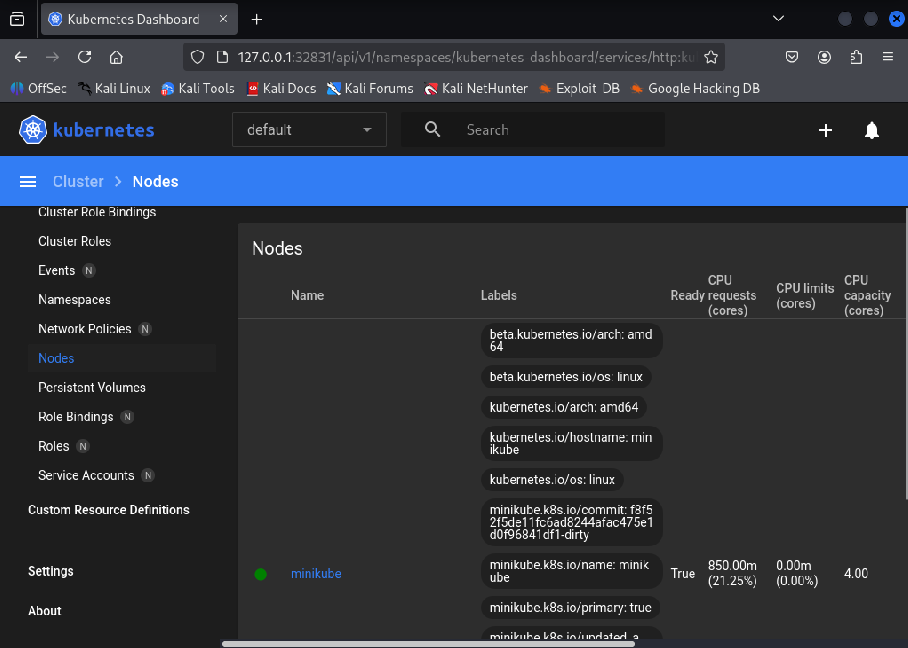
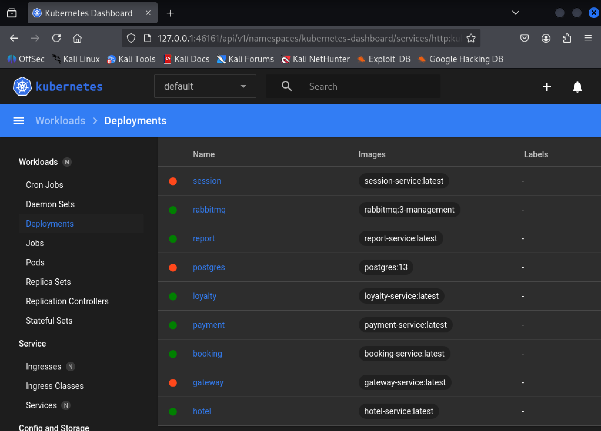
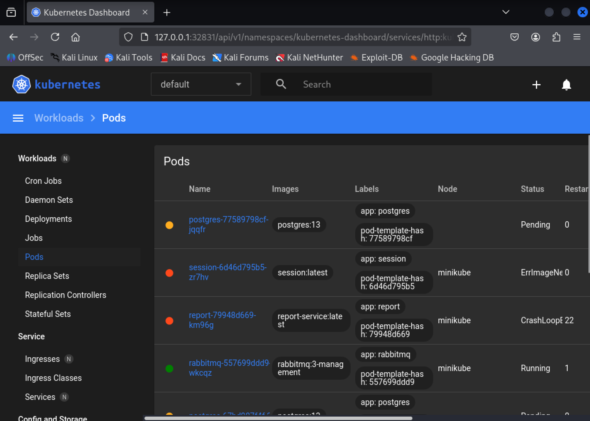
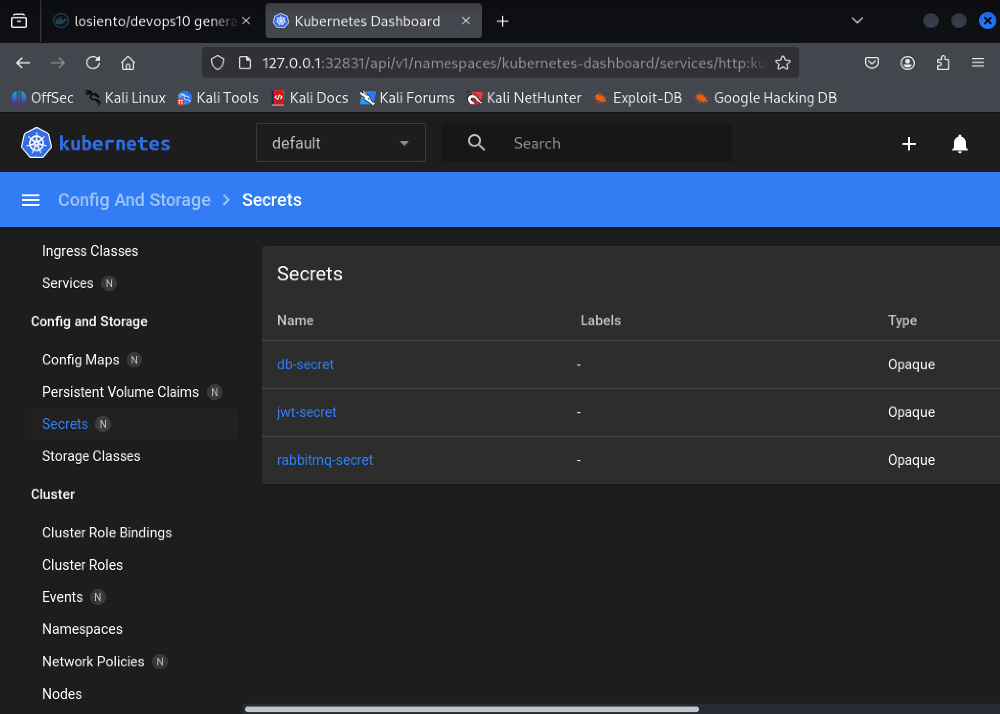
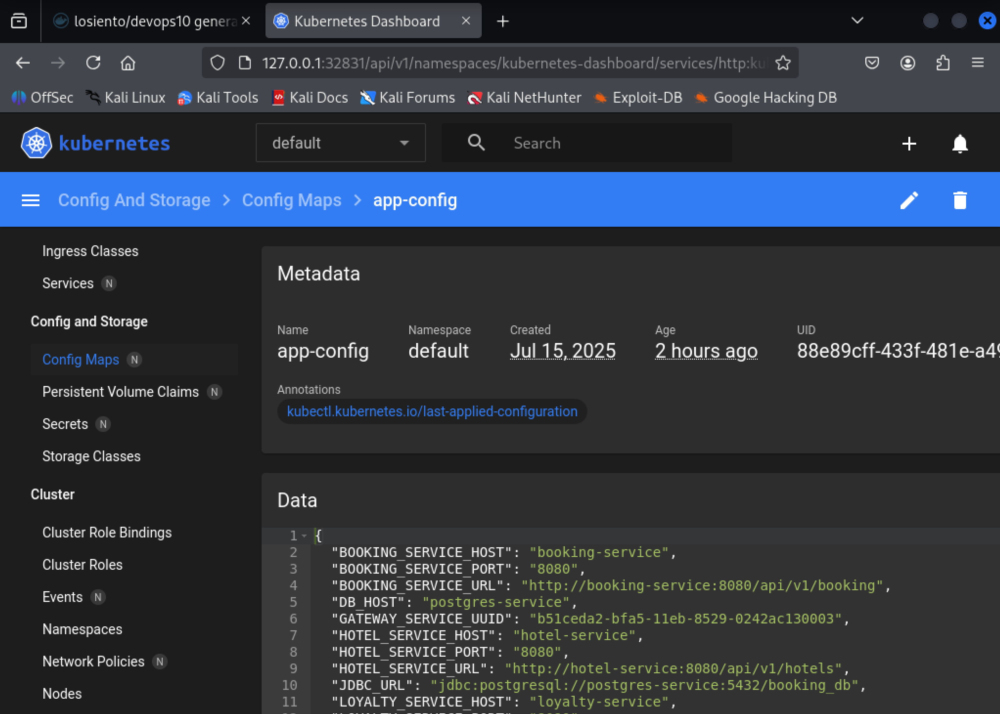
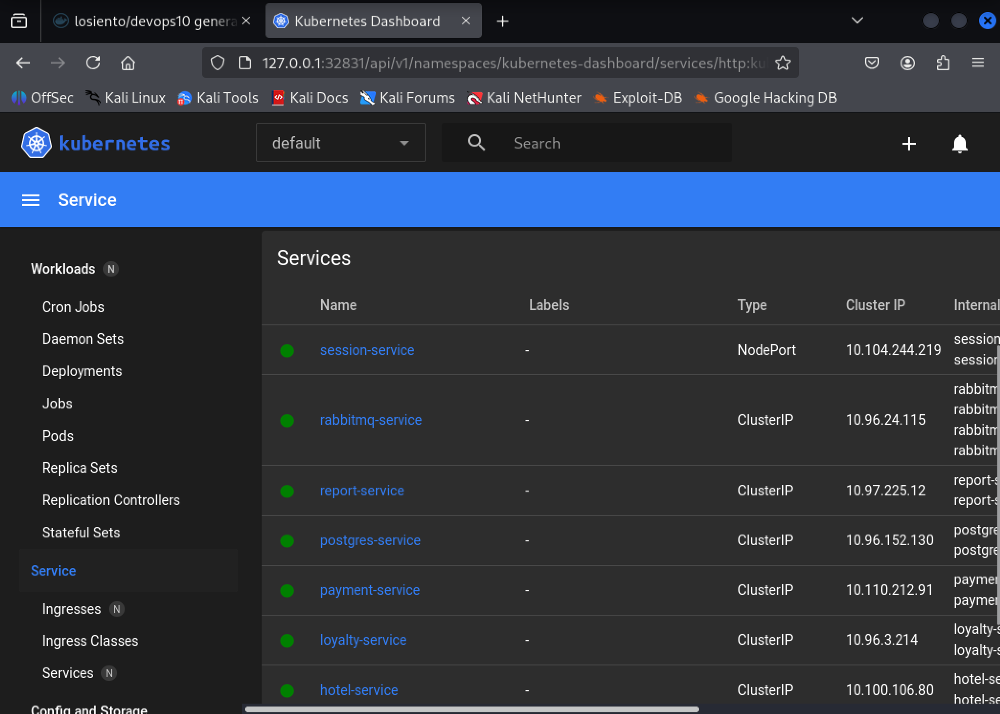
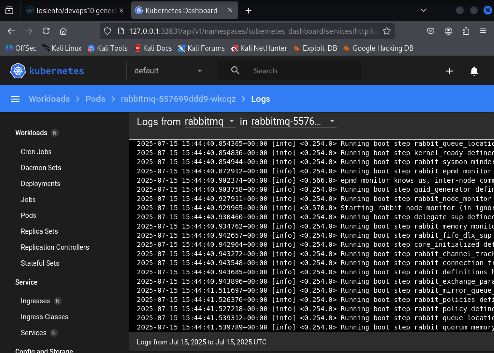

- Нужно измерить время обновления для стратегий Recreate и Rolling Update
- Провел тестирование стратегий обновления на примере PostgreSQL.
- Тестирование стратегии Recreate (postgres-recreate.yaml):

```bash
# Замерить время
start_time=$(date +%s)
kubectl rollout restart deployment postgres
kubectl rollout status deployment postgres
echo "Recreate время: $(($(date +%s) - start_time)) сек"
```
- Тестирование стратегии Rolling Update (postgres-rolling.yaml):

```bash
# Замерить время
start_time=$(date +%s)
kubectl rollout restart deployment postgres
kubectl rollout status deployment postgres
echo "Rolling Update время: $(($(date +%s) - start_time)) сек"
```

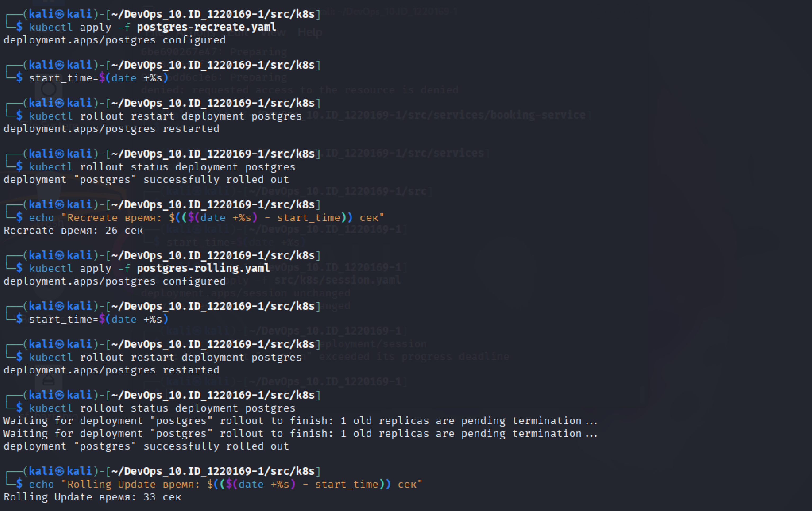
